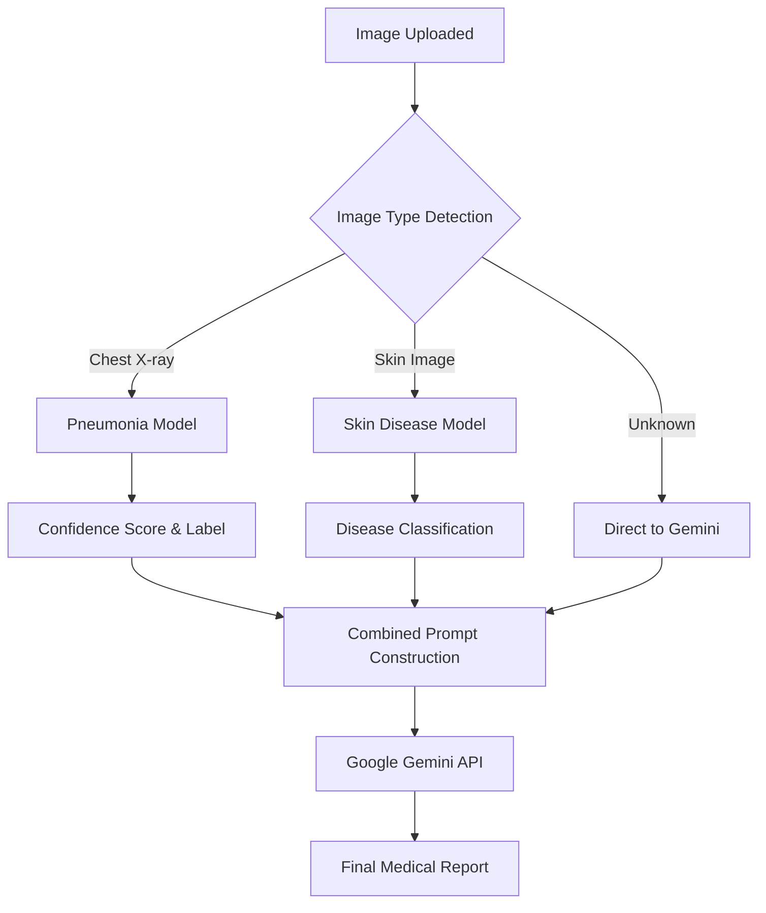

# 🩺 Smart Healthcare AI Chatbot

A comprehensive healthcare assistant that combines **Google Gemini API** for symptom analysis with **Custom TensorFlow Models** for medical image classification.

[](https://www.python.org/)
[](https://flask.palletsprojects.com/)
[](https://www.tensorflow.org/)
[](https://ai.google.dev/)

---

## 📋 Table of Contents
- [Project Overview](#-project-overview)
- [Tech Stack](#-tech-stack)
- [How It Works (Workflow)](#-how-it-works-workflow)
- [Installation & Setup](#-installation--setup)
- [Database Schema](#-database-schema)
- [File Structure](#-file-structure)
- [Medical Disclaimer](#-medical-disclaimer)

---

## 🌟 Project Overview
This chatbot provides a preliminary medical diagnosis based on user-described symptoms and uploaded medical images. It uses a **hybrid AI approach**:
1.  **Local Deep Learning Models**: For specialized medical image classification (Pneumonia & Skin Diseases).
2.  **Large Language Models (LLM)**: Leveraging Google's Gemini Pro for conversational context and final diagnostic synthesis.

### **Key Features**
- **Symptom Detection**: Automatically identifies if a user's query is medical-related.
- **Image Analysis**: Classifies Chest X-rays and Skin conditions locally.
- **Multimodal AI**: Combines visual data, local model insights, and user text into a final Gemini-powered report.
- **Conversation Tracking**: Full thread management with persistent database storage.

---

## 🛠 Tech Stack
- **Backend:** Python, Flask
- **Artificial Intelligence:** 
  - Google Gemini API (Multimodal)
  - TensorFlow/Keras (CNNs for medical imaging)
- **Database:** MySQL
- **Frontend:** HTML5, CSS3 (Modern UI), JavaScript (ES6)
- **Image Processing:** PIL (Pillow), NumPy

---

## 🔄 Kaise Kaam Karta Hai - Complete Flow

### **1. Image Analysis Pipeline**


### **2. Complete Logical Steps**

#### **Stage 1: Input Handling**
- **Image Upload:** System detects the image type based on resolution and aspect ratio (e.g., wider images are often Chest X-rays).
- **Text Query:** `symptom_detector.py` checks if the query contains medical keywords.

#### **Stage 2: Processing**
- **Local Analysis:** 
  - If a **Chest X-ray** is detected, `pneumonia_classification_model.h5` predicts 'Normal' or 'Pneumonia'.
  - If a **Skin Image** is detected, `skin_disease_final_model_2.h5` classifies the specific condition (e.g., Melanoma).
- **Fallback:** If local models fail or the image type is unknown, the system relies on Gemini's native vision capabilities.

#### **Stage 3: Synthesis (API Call)**
The system sends three critical pieces of information to Gemini:
1.  **Original Image:** For Gemini's vision analysis.
2.  **Model Insights:** The classification result from our local specialized models (used as "expert hints").
3.  **User Symptoms:** Any text description provided by the patient.

#### **Stage 4: Final Output**
Gemini generates a structured response containing:
- **Diagnosis:** Possible health condition.
- **Probability:** Estimated certainty.
- **Severity:** (Mild/Moderate/Severe).
- **Medication:** Suggested OTC or general advice.
- **Next Steps:** Recommendation for clinical consultation.

---

## 🚀 Installation & Setup

### **1. Dependencies**
```bash
pip install -r requirements.txt
```

### **2. Database Configuration**
1.  **Create Database:** `CREATE DATABASE chatbot;`
2.  **Configure `config.py`**:
    ```python
    MYSQL_HOST = "localhost"
    MYSQL_USER = "root"
    MYSQL_PASSWORD = "your_password"
    MYSQL_DB = "chatbot"
    ```

### **3. API Key Setup**
Obtain a Gemini API key from [Google AI Studio](https://aistudio.google.com/) and update `config.py`:
```python
GEMINI_API_KEY = "YOUR_API_KEY"
```

### **4. Run Application**
```bash
python app.py
```
Open `http://localhost:5000` in your browser.

---

## 🗄 Database Schema
| Table | Description |
| :--- | :--- |
| `users` | Stores account details and hashed passwords. |
| `chat_threads` | Manages multiple conversation sessions per user. |
| `posts` | Stores raw chat history (text & image filenames). |
| `structured_responses` | Stores parsed diagnostic data for structured analysis. |

---

## 📂 File Structure
- `app.py`: Main entry point and Flask routes.
- `api_connection.py`: Orchestrator between models and Gemini.
- `image_analyzer.py`: Image preprocessing and local ML execution.
- `db_manager.py`: Database table creation and maintenance.
- `promt_builder.py`: Constructs complex instructions for Gemini.
- `response_parser.py`: Extracts data from AI responses for DB storage.

---

## ⚠️ Medical Disclaimer
> [!IMPORTANT]
> This application is for **informational and educational purposes only**. It does not provide medical advice, diagnosis, or treatment. Always seek the advice of your physician or other qualified health provider with any questions you may have regarding a medical condition.

---
**Developed with ❤️ to bridge the gap between AI and Healthcare.**
